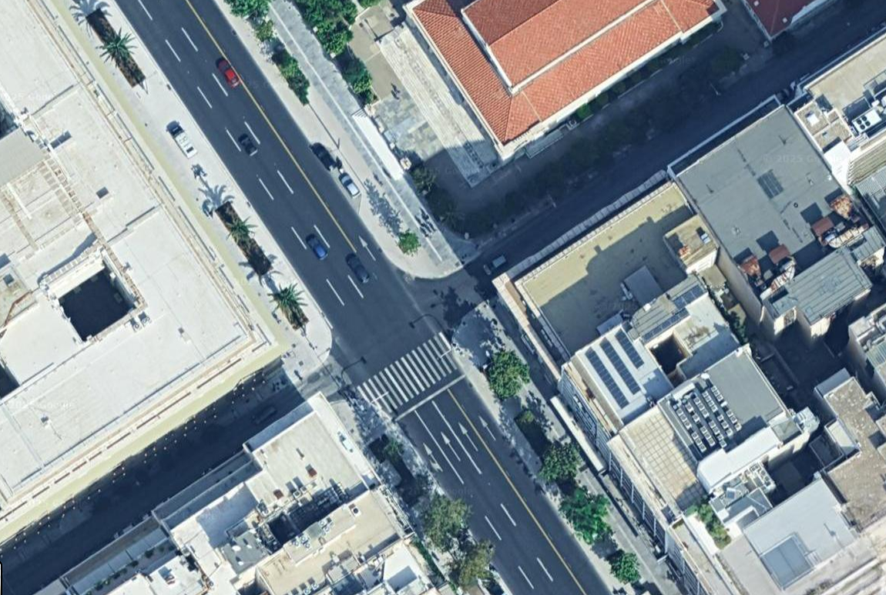
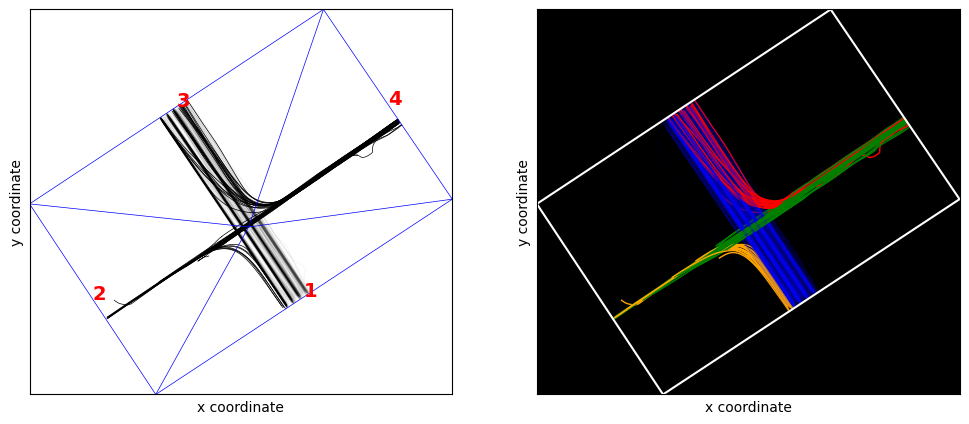
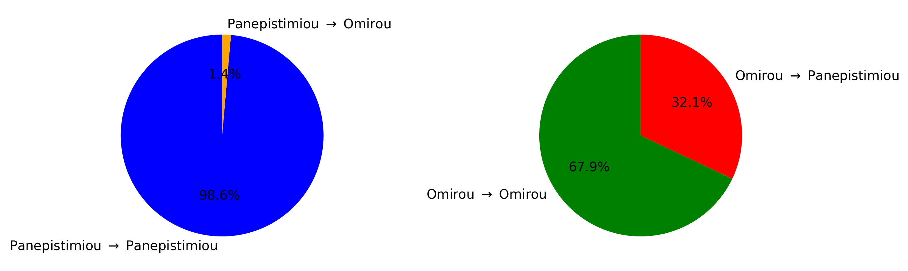
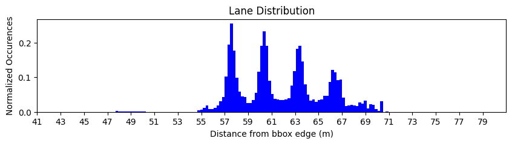
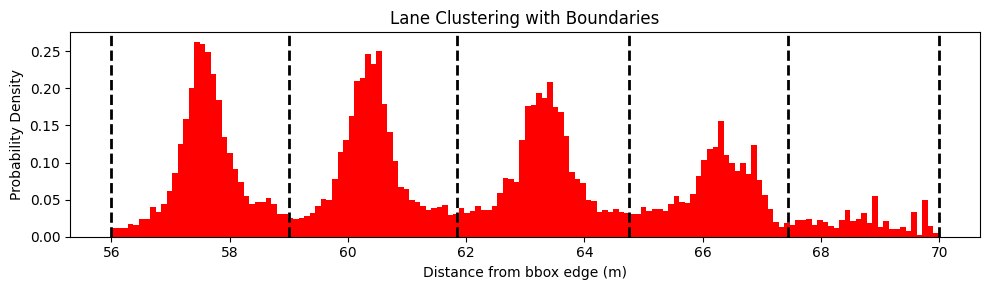
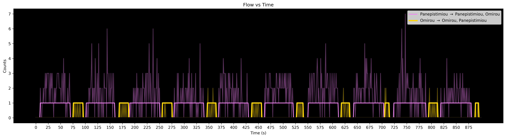

# UAV-Traffic-Tool
Python tool for analysis and visualization of UAV-based traffic data obtained in urban environments. 

# How to use UAV-traffic-tool for intersections
## Introduction

This section provides a detailed walkthrough on how to use `UAV-Traffic-Tool` properly in order to extract valuable information and make insightful visualizations regarding urban signalized intersection in the light of drone-based traffic data. Here, we follow closely the code provided in [this usage example](https://github.com/KPourgourides/UAV-Traffic-Tool/blob/main/usage%20example/intersection_pipeline_example.ipynb).

**Warning**: *in this walkthrough we use data from the open-source [pNEUMA dataset](https://open-traffic.epfl.ch/index.php/downloads/), and specifically the dataset `20181024_d2_0900_0930.csv`. We proceed to use the tool for a specific intersection contained in this dataset, which has a certain topology, entry and exit points, components, lanes, traffic cycles, and other characteristics. When we deploy the tool for a different intersection, we should make the appropriate modifications.*

## Acquiring the data in the correct format

In order to use the tool properly in later stages, the first and most important task of all is to acquire the drone-based
traffic data we want to analyze in the correct format. Different datasets use different formats, and oftentimes
they are not very intuitive for the sake of compactness. For this reason, the tool was designed
to take the input data in a universal and well structured format, which will be explained in detail below.
Thus, we might have to do some data pre-processing before being able to successfully deploy the tool for
their research.

Usually, drone-based traffic datasets include information for the different vehicles in the recording,
such as the id and the vehicle type (e.g., car, motorcycle, bus). Additionally, they also include the positions, instantaneous speeds and accelerations, all as a functions of time. 

**Note:** *The positions are typically 2 dimensional coordinates, and they are always given with respect to a reference system; for example, this system could be the World Geodetic System 84, which uses latitude and lognitude coordinates.*

The correct format in which to give these data as
an input to the tool is to create a dictionary that contains different keys, where each key corresponds to a list.
Each list corresponds to a piece of the information mentioned above per vehicle, and either includes scalar values (such as ids and types, which
remain constant throughout the dataset), or lists (such as position, speed, which evolve through
time).

**Note:** *Acceleration is not needed as an input to the tool, as it can be extracted later through time differentiation of speed, which is almost always provided.*

An example of the correct data format is

```
data = { 
          'id' : id,
          'vtype' : vtype,
          'x' : x,
          'y' : y,
          'time' : t,
          'speed' : u
        }
```

An example of what they keys could correspond to

`data.get('id') =` [0,1,...,N] $\to$ N+1 total vehicles

`data.get('vtype') =` ['Car','Bus',...,'Taxi']

`data.get('x') =` $[x^0,x^1,...,x^N]$ $\to$ Each element is a list

`data.get('y') =` $[y^0,y^1,...,y^N]$ $\to$ Each element is a list

`data.get('time') =` $[t^0,t^1,...,t^N]$ $\to$ Each element is a list

`data.get('speed') =` $[u^0,u^1,...,u^N]$ $\to$ Each element is a list

In order to undestand the content of the keys for a vehicle with id i, an example is given below in the case where the drone camera is 30FPS and the vehicle spent 1 second in the recording

`index_i = data.get('id').index(i)`

`data.get('id')[index_i]` = $i$

`data.get('vtype')[index_i] = 'Car'`

`data.get('time')[index_i]` = $t^i$ = [0,1,...,29]

`data.get('x')[index_i]` = $x^i$ = $[x(0),x(1),...,x(29)]^i$

`data.get('y')[index_i]` = $y^i$ = $[y(0),y(1),...,y(29)]^i$

`data.get('speed')[index_i]` = $u^i$ = $[u(0),u(1),...,u(29)]^i$

The time list includes the time stamps when the vehicle was in the recording, with respect to
the beginning of the recording, which is usually set to 0 seconds. The rest of the lists include the values of
the corresponding quantities at each time stamp. 

When a drone-based traffic dataset is converted to the format described above, the user is ready to use
the tool to conduct their analysis and visualization tasks for an intersection (or link) of their choice. An example on
how to do the above data transformations on the pNEUMA dataset exists at [this location](https://github.com/KPourgourides/UAV-Traffic-Tool/blob/main/tests/dataload_example.py).

## Setting up the analysis

After we have transformed the original data (also referred to as `raw_data`) to the correct format by following
the instructions of the previous, we can proceed further with analysis and visualization tasks.

### Defining the intersection under study

Initially, we must locate the intersection we want to work with by using satellite imagery software, for example GoogleMaps, and spot key information, such as the different movement and
turning directions. In this document, the signalized intersection between Panepistimiou Ave. and Omirou Str. in Athens, Greece is examined.




In this case, for Panepistimiou Ave., there are 5 lanes in total (4 normal + 1 bus lane), and drivers can either
drive forward or turn leftwards into Omirou Str. Only 4 lanes are visible above, as the picture is from 2024, while the recording dataset was collected in 2018, when there were 5 lanes.

For Omirou Str., there is only one lane, and drivers can either drive forward
or turn rightwards into Panepistimiou Ave..

### Acquiring preliminary information on the intersection

Before proceeding further, we must acquire some preliminary spatio-temporal information on the intersec-
tion, which will be a stepping stone for later.

The first task is to define the status of a boolean constant called `wgs` (Word Geodesic System), which will let
the tool know whether it is about to handle geo-spatial (i.e. latitude and longitude coordinates) information, in the
case `wgs is True`, or position coordinates in another reference system (e.g., coordinates for camera pixels), if `wgs is False`.


The next piece of information we need to gather is the `bbox ` (bounding box), which is essentially four sets of spatial coordinates that
define (are the vertices of) a box which encloses the intersection. It is important to note that the box edges should be parallel to the roads of the intersection. 
The `bbox` will help with reducing the dataset to include information only
about the vehicles which belong to the area of interest, i.e. keep data for the vehicles that have traversed the
intersection at least once at any point during the recording. Data for the rest of the vehicles will be
discarded. The `bbox` has the following form

```
bbox = [
        (ll_y,ll_x),
        (lr_y,lr_x),
        (ur_y,ur_x),
        (ul_y,ul_x),
        ]
```

Where ll,lr,ur, and ul correspond to lower left, lower right, upper right, upper left respectively. If `wgs is
True`, these coordinates can be picked up from GoogleMaps; if not, we must provide appropriate coordinates
according to the reference system for positions. 

Additionally, we must provide a tuple with the center coordinates of the intersection

`intersection_center = (y_center,x_center)`

The last piece of preliminary information is a global `time_axis` for the recording. For example, if the recording
lasted for 3 minutes, the global `time_axis` should start at 0 seconds and end at 180 seconds. We
obtain the start and end of the `time_axis` in the following fashion

```
start = min(min(vector) for _i,vector in enumerate(raw_data.get('time')))
end = max(max(vector) for _i,vector in enumerate(raw_data.get('time')))
```

The length of the `time_axis` (i.e. the update period of measurements in it) can be set by the user to correspond
the refresh period of the measurements of the recording, or any other integer multiple of that. Also, the decimal
points in the values of the `time_axis` should correspond to that of the original measurements from the recording.
Finally, we define the `time_axis`  through the following commands

```
time_axis = np.arange(start,end+update_period,update_period)
time_axis = list(np.round(time_axis,decimals=correct_decimals))
```

Once we have gathered all the above information, it should be stored in a dictionary in
the following fashion


```
spatio_temporal_info = {
                        'wgs' : wgs,
                        'bbox' : bbox,
                        'intersection center' : intersection_center',
                        'time axis' : time_axis
                        }                  
```


## Analysis & Visualization

### Loading the tool

To load the tool, we run the following commands

```
import mytool.uav_traffic_tool as uav
tool = uav.Wiz()
```

In order to load classes and their methods, we simply run the following

```
class = tool.class_name(args)
method = class.method_name(args)
```

### Filtering the data

Before proceeding with the rest of the analysis, we can optionally apply some filters to the data
to flush out parked vehicles. A vehicle is considered to be parked when it spent more than 95% of its presence in the dataset being immovable. 
This is achieved when we run the following command

`data = tool.dataloader(raw_data,spatio_temporal_info).get_filtered_data()`

Optionally, we can also pass an argument called `cursed_ids`, where we can list any vehicle ids that we
desire to have explicitly removed from the dataset, even if they are not considered to be parked.

### Categorizing the trajectories based on their entry and exit points in the intersection

The first task is to group trajectories based on their origin (o) and destination (d), i.e. entry and exit points within
the intersection. This will be important for later steps when we want to separate the data based on their od pair
and conduct separate analyses.

Initially, the intersection is split into 4 triangles using the `intersection_center` and the `bbox `. Each triangle is labeled with numbers 1 through 4, starting
from the lower part of the intersection and proceeding clockwise. For each vehicle, an od pair is assigned; for
example, if a vehicle enters the intersection within triangle 1 and exits it within triangle 3 (i.e. driving forward on
Panepistimiou Ave.), then the assigned od pair will be `(1,3)`. We achieve this by running the following commands

```
analysis = tool.analysis(data,spatio_temporal_info)
od_pairs = analysis.get_od_pairs()
```

For our intersection, the correct od pairs are `(1,3)` (Driving forward on Panepistimiou Ave.),
`(1,2)` (Initially driving on Panepistimiou Ave. and then turning leftwards into Omirou Str.), `(4,3)` (Initially driving on
Omirou Str. and then turning rightwards into Panepistimiou Ave.), and finally `(4,2)` (Driving forward on Omirou Str.).

We can visualize the trajectories of the different od groups with different colors for clarity by
running the following commands

```
visualization = tool.visualization(data,spatio_temporal_info)
visualization.draw_trajectories_od(valid_od_pairs)
```



The argument `valid_od_pairs` is a list that must contain the correct od pairs. In our case, it would be `valid_od_pairs = [(1,3),(1,2),(4,3),(4,2)]`.
This is done to avoid visualizing any vehicles that have unwanted od pairs. This can happen, for
example, when a motorcycle is driving in the opposite direction of normal traffic on a pavement to deliver a package. 

The trajectory categorization can also help us with figuring out the turn ratios for each street




### Separating the data based on od pairs

The next step is to separate the data into smaller sub-dictionaries based on the different trajectory origins. Essentially,
the objective is to isolate data which belong to the same traffic light phase, i.e. have the same origin within the
intersection. Their destination need not be the same. In our case, we must make two data sub-dictionaries
for od pairs `[(1,3),(1,2)]` and `[(4,3),(4,2)]` respectively. To do this, we run these commands

```
data_13_12 = analysis.get_od_data(desirable_pairs=[(1,3),(1,2)])
data_43_42 = analysis.get_od_data(desirable_pairs=[(4,3),(4,2)])
```
In the following steps of the analysis and visualization process, the methods are applied separately on the
two sub-dictionaries. To do this, we activate separate analysis and visualization classes with the following
commands

```
analysis_13_12 = tool.analysis(data_13_12,spatio_temporal_info)
visualization_13_12 = tool.visualization(data_13_12,spatio_temporal_info)
#------------------------------------------------------------------------
analysis_43_42 = tool.analysis(data_43_42,spatio_temporal_info)
visualization_43_42 = tool.visualization(data_43_42,spatio_temporal_info)
```

### Extracting lane-wise information

The next task is to extract lane-wise information for the components of the intersection, i.e. Panepistimiou Ave.
and Omirou Str. in our case. By lane-wise information, we mean the number of lanes, their spatial boundaries, and the distribution of vehicles in them for each of their time steps.

We can extract the number of lanes in a street the calculation of the perpendicular distance between
its vehicles and an imaginary line running parallel to itself (e.g., an appropriate edge of the `bbox`). Once this distance is calculated for all time steps
of all vehicles in the street, the average of each vehicle can be plotted. It is expected that this quantity will
be normally distributed around the center of each existent lane. For example, to visualize this distribution for Panepistimiou Ave., we simply run the following command

`lane_info_13_12 = analysis_13_12.get_lane_info(flow_direction='up')`

Where `flow_direction` is one of `['up','down','left','right]`, and denotes the traffic flow direction in the street under investigation (North corresponds to `'up'`, South corresponds to `down`, etc.). Initially, this will pop on our screen



We will be asked to input the number of lanes we see (i.e. the number of peaks), in this case 5, and subsequently we will be asked to provide the lower (e.g., 55.0) and upper (e.g., 71.0) limit of the distribution. After we input this information,
a clustering algorithm will figure out the spatial boundaries of each lane behind the scenes, and we will see the final product



`lane_info_13_12` is a dictionary that includes all the information we need. Its keys are `number` and `boundaries`, which are 5 and `[55.0, 58.96, 61.85, 64.77, 67.61, 71.0]` respectively in our case. Also, it has an additional
key called `distribution`, which is a list of lists. Each nested list corresponds to a different vehicle, and includes the lane in which the vehicle belonged to per one of its time steps. If at some point a vehicle has left the road, the corresponding values from that point onwards will be `None`. 

We can also optionally pass some extra arguments to the `get_lane_info()` method, such as `nbins` (integer, the number of bins in the histogram), `valid_od_pairs` (list of tuples, each tuple is one of the od pairs the distribution will be calculated for.
For example, for Panepistimiou Ave., we can potentially only visualize the distribution for od pair `(1,3`, as vehicles with od pairs `(1,2)` will at some point turn into Omirou Str.), `avg_d_from_bbox_edge` (boolean, whether the average value or all the values of the perpendicular distance are plotted in the distribution per vehicle), and `custom_boundaries` (if we are unsatisfied with the boundaries provided by the clustering algorithm, we can se custom boundaries through inputs). The default values for these optional arguments are `200`,`None`, `False` and `False`.


## Extracting traffic light phases & cycles

### Traffic Light Phases

Another useful task when it comes to signalized intersections is studying the different traffic light phases, i.e. when the light becomes green, for how long it stays green, when it turns red, and when it goes to green
again. In order to achieve that for a certain traffic light, a virtual detector 
is placed at the position of the real traffic light pole. The
detector measures flow counts per moment of the time axis. Initially, we type these commands

```
flow_info_13_12 = analysis_13_12.get_flow_info(detector_position_13_12)
flow_info_43_42 = analysis_43_42.get_flow_info(detector_position_43_42)
```

Where the `detector_position` argument is a tuple with the coordinates (y,x) of the virtual detector. The
result of the `get_flow_info()` methods is a dictionary of dictionaries, where each nested dictionary has the keys
`time stamp` (float), `flow` (integer) and `id` (list), which respectively correspond to the moment of measurement with respect to
the time axis, the number of registered counts between the current and previous time stamp, and
the ids of the vehicles responsible for the registered count hits. The `id` list is empty if 0 counts were
registered in the corresponding time interval. For example,

```
flow_info_13_12 = {
                    {'time stamp': 0.0, 'flow': 0, 'id': []},
                      .
                      .
                      .
                    {'time stamp': 24.0, 'flow': 4, 'id': [71,128,142,145]},
                      .
                      .
                      .
                    {'time stamp': 900.0, 'flow': 0, 'id': []}
                  }
```


The above information is utilized to alter the flow detectors outputs into binary (1 if there were registered
count hits, 0 if there were not), and group them together to form the different traffic light phases. In order to do that, we must run

```
flow_13_12,norm_flow_13_12 = analysis_13_12.get_normalized_flow(threshold)
flow_43_42,norma_flow_43_42 = analysis_43_42.get_normalized_flow(threshold)
```

The `threshold` arguments refer to the maximum accepted distance (in time) in order to consider count hits in
the same group. The output of both `flow_13_12`,`flow_43_42` is a list with the unnormalized hits per time axis entry, and the output of both `norm_flow_13_12`,`norm_flow_43_42`
is also a list, but this time with the normalized and grouped hits per time axis entry.

To visualize the above, we run the command

```
legend_13_12=r'Panepistimiou $\to$ Panepistimiou, Omirou'
legend_43_42=r'Omirou $\to$ Omirou, Panepistimiou'
visualization.draw_traffic_light_phases(legend_13_12,legend_43_42,norm_flow_13_12,norm_flow_43_42,flow_13_12,flow_43_42)
```



If there are any count hits that visibly violate the red traffic light (e.g., a violet count hit while a golden phase in on), we can find the respective id in order to remove it from the dataset if we want.
To do this, we run one of the two commands, depending on which data sub-dictionary the violating vehicle belongs to

```
analysis_13_12.get_cursed_id(low_lim,high_lim)
analysis_43_42.get_cursed_id(low_lim,high_lim)
```

These functions print the ids of the vehicles that registered hits at each step of the `time_axis` between the values `low_lim` and `high_lim`, in order for us to be able to know which one we want to remove. In order to zoom in on the previous plot and
see the time-area of interest in more detail, we can pass the optional arguments `activate_zoom`,`high_lim` and `low_lim` to `draw_traffic_light_phases()`.

To translate the above figure into formal traffic light phase data, we run the following commands

```
tlp_13_12 = analysis_13_12.get_traffic_light_phases()
tlp_43_42 = analysis_43_42.get_traffic_light_phases()
```

The output of both `tlp_13_12`, `tlp_43_42` is a list of dictionaries, where each dictionary has the keys 
`Green`,`Duration ON`,`Red`,`Duration OFF`,`Phase Duration`, which respectively correspond to the moment the re-
spective traffic light turned green, the duration of green, the moment it turned red, the duration of red, and the
entire phase duration (all in seconds). For example,

```
tlp_13_12[0] = {
                'Green': 10.0,
                'Duration ON': 60.0,
                'Red': 70.0,
                'Duration OFF': 32.0,
                'Phase Duration': 92.0
               }
```

If the recording had stopped before the completion of a phase, the appropriate keys will have the value
`None`. For example, if the recording stopped while the traffic light was red, the key `Duration OFF` cannot be
calculated, and the same holds for key `Phase Duration`.

### Traffic Light Cycles

We combine `tlp_13_12`, `tlp_43_42`  in order to get the information on the full cycles, i.e. the
subsequent completion of the 2 individual phases. To do so, we run the following command

`cycles = analysis.get_traffic_light_cycles(tlp_13_12,tlp_43_42)`

The output of `cycles` is a list of dictionaries, where each dictionary has the keys `Start`,`Break`,
`Continue`,`Stop`,`End`, which respectively correspond to the moment the cycle started (i.e. the first phase started), the
moment the cycle stops temporarily (i.e. the first phase goes into red), the moment the cycle restarts (i.e. the
second phase started), the moment the cycle stops (i.e. the second phase goes into red), and finally, the moment
the cycle restarts (i.e. the first phase has re-started) respectively. For example,

```
cycles[0] = {
             "Start": 10.0,
             "Break": 70.0,
             "Continue": 76.0,
             "Stop": 96.0,
             "End": 102.0
            }
```

## Extracting queue-wise information


