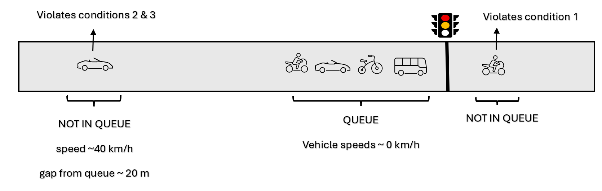

# UAV-Traffic-Tool

The recent introduction of drone-based data collection methods in Intelligent
Transportation Systems research has unlocked a new realm of possibilities which was inaccessible in the past due to limitations posed by traditional
sensor-based methods. The quick deployment of coordinated, camera-equipped drones above a large traffic
network, gives researchers the opportunity to acquire large volumes of traffic data with high spatio-temporal
resolution, which greatly benefits data analysis. `UAV-Traffic-Tool` is an open-source Python-based software dedicated to detailed scientific analysis and visulization of 
drone-based traffic data, especially regarding signalized intersections in urban networks.

# How to use UAV-traffic-tool for intersections

## Table of contents
- [Introduction](#introduction)
- [Acquiring the data in the correct format](#acquiring-the-data-in-the-correct-format)
- [Setting up the analysis](#setting-up-the-analysis)
  - [Defining the intersection under study](#defining-the-intersection-under-study)
  - [Acquiring important spatio-temporal information on the intersection](#acquiring-important-spatio-temporal-information-on-the-intersection)
- [Analysis & Visualization](#analysis--visualization)
  - [Loading the tool](#loading-the-tool)
  - [Filtering the data](#filtering-the-data)
  - [Categorizing the trajectories based on their routes](#categorizing-the-trajectories-based-on-their-routes)
  - [Separating the data based on od pairs](#separating-the-data-based-on-od-pairs)
  - [Extracting lane-wise information](#extracting-lane-wise-information)
  - [Extracting traffic light phases & cycles](#extracting-traffic-light-phases--cycles)
      - [Traffic light phases](#traffic-light-phases)
      - [Traffic light cycles](#traffic-light-cycles)
  - [Extracting relative dynamic gaps](#extracting-relative-dynamic-gaps)
  - [Extracting queue-wise information](#extracting-queue-wise-information)

## Introduction

This section provides a detailed walkthrough on how to use `UAV-Traffic-Tool` properly in order to extract valuable information and make insightful visualizations regarding urban signalized intersection in the light of drone-based traffic data. Here, we follow closely the code provided in [this usage example](https://github.com/KPourgourides/UAV-Traffic-Tool/blob/main/usage%20example/intersection_pipeline_example.ipynb).

**Warning**: *in this walkthrough we use data from the open-source [pNEUMA dataset](https://open-traffic.epfl.ch/index.php/downloads/), and specifically the dataset `20181024_d2_0900_0930.csv`. We proceed to use the tool for a specific intersection contained in this dataset, which has a certain topology, entry and exit points, components, lanes, traffic cycles, and other characteristics. When we deploy the tool for a different intersection, we should make the appropriate modifications.*

## Acquiring the data in the correct format

In order to use the tool properly in later stages, the first and most important task is to acquire the drone-based
data we want to analyze in the **correct format**. Different datasets use different formats which are oftentimes
unclear for the sake of compactness. Because of this, the tool was designed
to take the input data **only in one format**. Thus, we might have to do some data pre-processing before being able to successfully deploy the tool for
our research.

Drone-based traffic datasets usually include information on the different individual vehicles in the recording,
such as the **IDs** (unique numbers) and the **types** (e.g., car, motorcycle, bus). Additionally, they also include the **positions** and instantaneous **speeds** labeled by **time**.

**Note:** *The positions are 2 dimensional coordinates (y,x), and are always given with respect to a reference system; for example, the World Geodetic System 84, which uses latitude and lognitude.*

`UAV-Traffic-Tool` takes the above data as input in order to perform analysis and visualization tasks. The correct way to pass the data to `UAV-Traffic-Tool` is to create a **dictionary**, where each key corresponds to a different piece of information (e.g., IDs, type, position, speed, time). For example,

```
data = {'id':id, 'vtype':vtype, 'x':X, 'y':Y, 'time':T, 'speed':U}
```

Each key of this dictionary corresponds to a list. For **id** and **vtype** the lists contain integer and string elements which respectively correspond to a unique number and a type for each vehicle. For example,

```
data.get('id') = [0,1,...,N]

data.get('vtype') = ['Car','Motorcycle',...,'Bus']
```

Where N+1 the total number of vehicles. The rest of the dictionary keys also correspond to lists that have more lists inside, one per vehicle in the dataset. The elements of each nested list correspond to different time stamps, and their length varies based on how much time the corresponding vehicle spent in the recording. For example,

`data.get('time')` = $[T^0,T^1,...,T^N]$

`data.get('x')` = $[X^0,X^1,...,X^N]$

`data.get('y')` = $[Y^0,Y^1,...,Y^N]$

`data.get('speed')` = $[U^0,U^1,...,U^N]$

To understand the content of the nested lists, we see below how they would look like for a vehicle with id $i$

$T^i$  = $[t_0,...,t_k]^i$

$X^i$  = $[x(t_0),...,x(t_k)]^i$

$Y^i$  = $[y(t_0),...,y(t_k)]^i$

$U^i$  = $[u(t_0),...,u(t_k)]^i$

Where $k+1$ the total number of time steps *(or measurements)* of the vehicle in the recording. The frequency of the time steps *(how many of them in 1 second)* is equal to the refresh rate of the drone's camera. 

When we convert a drone-based traffic dataset in the format described above, we are ready to use
`UAV-Traffic-Tool` to conduct our analysis and visualization tasks for an intersection of our choice. An example on
how to do the above data transformations on the pNEUMA dataset exists at [this location](https://github.com/KPourgourides/UAV-Traffic-Tool/blob/main/tests/dataload_example.py) in the repository.

## Setting up the analysis

### Defining the intersection under study

Initially, we must identify the intersection we want to work with through satellite imagery software, for example GoogleMaps, and spot important information such as the different movement and
turning directions. In this walkthrough, we study the signalized intersection between Panepistimiou Ave. and Omirou Str. in Athens, Greece, which is pictured below.


For Panepistimiou Ave., there are 5 lanes in total *(4 normal + 1 bus lane)*, and drivers can either
drive forward or turn leftwards into Omirou Str.. Only 4 lanes are visible above as the picture is from 2024, while the recording was conducted in 2018, when there was an extra lane. For Omirou Str., there is only 1 lane, and drivers can either drive forward or turn rightwards into Panepistimiou Ave..

### Acquiring important spatio-temporal information on the intersection

Before proceeding further, we must acquire some important spatio-temporal information on the intersection we want to work with, which will serve as a stepping stone for later.

The first task is to define the status of a boolean constant called `wgs` which stands for Word Geodesic System. This constant will let
the tool know whether it is about to handle geo-spatial position coordinates in the
case where `wgs is True`, or coordinates in another reference system *(e.g., camera pixels)*, if `wgs is False`. This differentiation is important because some mathematical formulas for distances have altered form when using geo-spatial position coordinates due to Earth's curve.

The next piece of information we need to gather is the `bbox ` *(bounding box)*, which is essentially a list of four sets of spatial coordinates that
define *(are the vertices of)* a box that encloses the intersection. It is important that the box edges perpendiculary intersect the components of *(roads that make up)* the intersection. 
The tool will use the `bbox` to only keep data for vehicles that have traversed it at some point in the recording, and discard the rest that are irrelevant to the intersection, thus reducing the original dataset and making future analysis & visualization steps quicker. The `bbox` has the following form

```
bbox = [(ll_y,ll_x),(lr_y,lr_x),(ur_y,ur_x),(ul_y,ul_x)]
```

Where ll, lr, ur, and ul respectively correspond to lower left, lower right, upper right, and upper left. If `wgs is
True`, we can pick up these coordinates from GoogleMaps; if not, we must provide appropriate coordinates
according to the reference system for positions. 

Additionally, we must provide a tuple with the center coordinates of the intersection, which will be used for some specific tasks later.

`intersection_center = (y_center,x_center)`

The last piece of information we need to gather is the `time_axis` of the recording. It is a list that contains all the time steps of the recording, independent of when individual vehicles entered or exited the intersection. Mathematically, the individual time axes of the vehicles, $[T^0,...,T^N]$, are subsets of the global `time_axis`. It is defined as

`time_axis`  = $[t^{\text{start}},...,t^{\text{end}}]$

The length *(the update period of measurements)* of the `time_axis` is equal to the refresh rate of the drone's camera.

Once we have gathered all the above information, we store it in a dictionary in the following fashion


```
spatio_temporal_info = {'wgs':wgs, 'bbox':bbox, 'intersection center':intersection_center', 'time axis':time_axis}                  
```


## Analysis & Visualization

### Loading the tool

To load the tool in the Python environment, we run the following commands

```
import mytool.uav_traffic_tool as uav
tool = uav.Wiz()
```

To set up the analysis and visualization classes, we simply run the following

```
analysis = tool.analysis(raw_data,spatio_temporal_info)
visualization = tool.visualization(raw_data,spatio_temporal_info)
```

### Filtering the data

Before proceeding, we can optionally apply some filters to the original data dictionary `raw_data`
to flush out parked vehicles, as they do not contribute in the traffic. A vehicle is considered to be parked if it spent more than 95% of its presence in the recording being immovable. 
This is achieved with the following command

`data = tool.dataloader(raw_data,spatio_temporal_info).get_filtered_data()`

We can also optionally pass an argument to `get_filtered_data()` called `cursed_ids`, where we can list any vehicle IDs that we
desire to have explicitly removed from the dataset, even if they do not satisfy the parking condition.

### Categorizing the trajectories based on their routes

The first task is to categorize the different vehicle trajectories based on their routes, or more specifically, based on their origin (o) and destination (d) within
the intersection. This will be important for later steps when we want to separate the data based on their od pair
to conduct separate analyses.

To achieve this, the intersection is split into 4 triangles using the `intersection_center` and the `bbox`. Each triangle is labeled with numbers 1 through 4, starting
from the lower part of the intersection and proceeding clockwise. An od pair is assigned for each vehicle. For
example, if a vehicle enters the intersection within triangle 1 and exits it within triangle 3 *(driving forward on
Panepistimiou Ave.)*, then the assigned od pair will be `(1,3)`. We do this by running the following command

`od_pairs = analysis.get_od_pairs()`

For our intersection, the correct od pairs are `(1,3)` *(Driving forward on Panepistimiou Ave.)*,
`(1,2)` *(Initially driving on Panepistimiou Ave. and then turning leftwards into Omirou Str.)*, `(4,3)` *(Initially driving on
Omirou Str. and then turning rightwards into Panepistimiou Ave.)*, and finally `(4,2)` *(Driving forward on Omirou Str.)*.

We can visualize the vehicle trajectories with different colors based on their od pair for clarity by
running the following command


`visualization.draw_trajectories_od(valid_od_pairs)`

The argument `valid_od_pairs` is a list that contains the correct od pairs. In our case, it would be `valid_od_pairs = [(1,3),(1,2),(4,3),(4,2)]`. The output is


 
This trajectory categorization is also helpful when it comes to figuring out the turn ratios for each street. In our case, they are depicted below


### Separating the data based on od pairs

The next step is to separate the data dictionary into smaller sub-dictionaries based on the different trajectory origins. Essentially,
the objective is to isolate data which belong to the same traffic light phase, i.e. have the same origin within the
intersection. **Their destination need not be the same**. In our case, we must make two data sub-dictionaries
for od pairs `[(1,3),(1,2)]` and `[(4,3),(4,2)]` respectively. To do this, we run these commands

```
data_13_12 = analysis.get_od_data(desirable_pairs=[(1,3),(1,2)])
data_43_42 = analysis.get_od_data(desirable_pairs=[(4,3),(4,2)])
```

In the following steps of the analysis and visualization process, the methods we will discuss are applied separately on the
two data sub-dictionaries. To do this, we set up separate analysis and visualization classes with the following
commands

```
analysis_13_12 = tool.analysis(data_13_12,spatio_temporal_info)
visualization_13_12 = tool.visualization(data_13_12,spatio_temporal_info)

analysis_43_42 = tool.analysis(data_43_42,spatio_temporal_info)
visualization_43_42 = tool.visualization(data_43_42,spatio_temporal_info)
```

### Extracting lane-wise information

The next task is to extract lane-wise information for the components of the intersection, i.e. Panepistimiou Ave.
and Omirou Str. in our case. By lane-wise information, we mean the number of lanes, their spatial boundaries, and the distribution of vehicles in them for each of their time steps.

We can extract the number of lanes in a street the calculation of the perpendicular distance between
its vehicles and an imaginary line running parallel to itself (e.g., an appropriate edge of the `bbox`). Once this distance is calculated for all time steps
of all vehicles in the street, the average of each vehicle can be plotted. It is expected that this quantity will
be normally distributed around the center of each existent lane. For example, to visualize this distribution for Panepistimiou Ave., we simply run the following command

`lane_info_13_12 = analysis_13_12.get_lane_info(flow_direction='up')`

Where `flow_direction` is one of `['up','down','left','right]`, and denotes the traffic flow direction in the street under investigation (North corresponds to `'up'`, South corresponds to `down`, etc.). Initially, this will pop on our screen


We will be asked to input the number of lanes we see (i.e. the number of peaks), in this case 5, and subsequently we will be asked to provide the lower (e.g., 55.0) and upper (e.g., 71.0) limit of the distribution. After we input this information,
a clustering algorithm will figure out the spatial boundaries of each lane behind the scenes, and we will see the final product


`lane_info_13_12` is a dictionary that includes all the information we need. Its keys are `number` and `boundaries`, which are 5 and `[55.0, 58.96, 61.85, 64.77, 67.61, 71.0]` respectively in our case. Also, it has an additional
key called `distribution`, which is a list of lists. Each nested list corresponds to a different vehicle, and includes the lane in which the vehicle belonged to per one of its time steps. If at some point a vehicle has left the road, the corresponding values from that point onwards will be `None`. 

We can also optionally pass some extra arguments to the `get_lane_info()` method, such as `nbins` (integer, the number of bins in the histogram), `valid_od_pairs` (list of tuples, each tuple is one of the od pairs the distribution will be calculated for.
For example, for Panepistimiou Ave., we can potentially only visualize the distribution for od pair `(1,3`, as vehicles with od pairs `(1,2)` will at some point turn into Omirou Str.), `avg_d_from_bbox_edge` (boolean, whether the average value or all the values of the perpendicular distance are plotted in the distribution per vehicle), and `custom_boundaries` (if we are unsatisfied with the boundaries provided by the clustering algorithm, we can se custom boundaries through inputs). The default values for these optional arguments are `200`,`None`, `False` and `False`.


### Extracting traffic light phases & cycles

#### Traffic Light Phases

Another useful task when it comes to signalized intersections is studying the different traffic light phases, i.e. when the light becomes green, for how long it stays green, when it turns red, and when it goes to green
again. In order to achieve that for a certain traffic light, a virtual detector 
is placed at the position of the real traffic light pole. The
detector measures flow counts per moment of the time axis. Initially, we type these commands

```
flow_info_13_12 = analysis_13_12.get_flow_info(detector_position_13_12)
flow_info_43_42 = analysis_43_42.get_flow_info(detector_position_43_42)
```

Where the `detector_position` argument is a tuple with the coordinates (y,x) of the virtual detector. The
result of the `get_flow_info()` methods is a dictionary of dictionaries, where each nested dictionary has the keys
`time stamp` (float), `flow` (integer) and `id` (list), which respectively correspond to the moment of measurement with respect to
the time axis, the number of registered counts between the current and previous time stamp, and
the ids of the vehicles responsible for the registered count hits. The `id` list is empty if 0 counts were
registered in the corresponding time interval. For example,

```
flow_info_13_12 = {
                    {'time stamp': 0.0, 'flow': 0, 'id': []},
                      .
                      .
                      .
                    {'time stamp': 24.0, 'flow': 4, 'id': [71,128,142,145]},
                      .
                      .
                      .
                    {'time stamp': 900.0, 'flow': 0, 'id': []}
                  }
```


The above information is utilized to alter the flow detectors outputs into binary (1 if there were registered
count hits, 0 if there were not), and group them together to form the different traffic light phases. In order to do that, we must run

```
flow_13_12,norm_flow_13_12 = analysis_13_12.get_normalized_flow(threshold)
flow_43_42,norma_flow_43_42 = analysis_43_42.get_normalized_flow(threshold)
```

The `threshold` arguments refer to the maximum accepted distance (in time) in order to consider count hits in
the same group. The output of both `flow_13_12`,`flow_43_42` is a list with the unnormalized hits per time axis entry, and the output of both `norm_flow_13_12`,`norm_flow_43_42`
is also a list, but this time with the normalized and grouped hits per time axis entry.

To visualize the above, we run the command

```
legend_13_12=r'Panepistimiou $\to$ Panepistimiou, Omirou'
legend_43_42=r'Omirou $\to$ Omirou, Panepistimiou'
visualization.draw_traffic_light_phases(legend_13_12,legend_43_42,norm_flow_13_12,norm_flow_43_42,flow_13_12,flow_43_42)
```


If there are any count hits that visibly violate the red traffic light (e.g., a violet count hit while a golden phase in on), we can find the respective id in order to remove it from the dataset if we want.
To do this, we run one of the two commands, depending on which data sub-dictionary the violating vehicle belongs to

```
analysis_13_12.get_cursed_id(low_lim,high_lim)
analysis_43_42.get_cursed_id(low_lim,high_lim)
```

These functions print the ids of the vehicles that registered hits at each step of the `time_axis` between the values `low_lim` and `high_lim`, in order for us to be able to know which one we want to remove. In order to zoom in on the previous plot and
see the time-area of interest in more detail, we can pass the optional arguments `activate_zoom`,`high_lim` and `low_lim` to `draw_traffic_light_phases()`.

To translate the above figure into formal traffic light phase data, we run the following commands

```
tlp_13_12 = analysis_13_12.get_traffic_light_phases()
tlp_43_42 = analysis_43_42.get_traffic_light_phases()
```

The output of both `tlp_13_12`, `tlp_43_42` is a list of dictionaries, where each dictionary has the keys 
`Green`,`Duration ON`,`Red`,`Duration OFF`,`Phase Duration`, which respectively correspond to the moment the re-
spective traffic light turned green, the duration of green, the moment it turned red, the duration of red, and the
entire phase duration (all in seconds). For example,

```
tlp_13_12[0] = {
                'Green': 10.0,
                'Duration ON': 60.0,
                'Red': 70.0,
                'Duration OFF': 32.0,
                'Phase Duration': 92.0
               }
```

If the recording had stopped before the completion of a phase, the appropriate keys will have the value
`None`. For example, if the recording stopped while the traffic light was red, the key `Duration OFF` cannot be
calculated, and the same holds for key `Phase Duration`.

#### Traffic Light Cycles

We combine `tlp_13_12`, `tlp_43_42`  in order to get the information on the full cycles, i.e. the
subsequent completion of the 2 individual phases. To do so, we run the following command

`cycles = analysis.get_traffic_light_cycles(tlp_13_12,tlp_43_42)`

The output of `cycles` is a list of dictionaries, where each dictionary has the keys `Start`,`Break`,
`Continue`,`Stop`,`End`, which respectively correspond to the moment the cycle started (i.e. the first phase started), the
moment the cycle stops temporarily (i.e. the first phase goes into red), the moment the cycle restarts (i.e. the
second phase started), the moment the cycle stops (i.e. the second phase goes into red), and finally, the moment
the cycle restarts (i.e. the first phase has re-started) respectively. For example,

```
cycles[0] = {
             "Start": 10.0,
             "Break": 70.0,
             "Continue": 76.0,
             "Stop": 96.0,
             "End": 102.0
            }
```

### Extracting relative dynamic gaps 

In order to extract vehicle ids sorted from last to first according to their direction of motion, and the corresponding gaps between them per step of the `time_axis`, we must run the following commands

```
sorted_id_13_12 = analysis_13_12.get_sorted_id()
gaps_13_12 = analysis_13_12.get_gaps()

sorted_id_43_42 = analysis_43_42.get_sorted_id()
gaps_43_42 = analysis_43_42.get_gaps()
```

The gaps are calculated from front bumper to rear bumper. This information will later help us to extract queue-wise
information, such as the queue length. The output of both methods is a list of dictionaries, where each dictionary
has the keys `time stamp`, and `lane 0` through `lane L`, where L+1 the total number of lanes. The `time
stamp` corresponds to the current step of the `time_axis`, and each lane-specific key is a list with the sorted ids or gaps (in meters). For example,

```
sorted_id_13_12[time_axis.index(tlp_13_12[7].get("Green"))] = {
                                                               "time stamp": 551.0,
                                                               "lane 0": None,
                                                               "lane 1": [1778],
                                                               "lane 2": [1922, 2021],
                                                               "lane 3": [2045, 1659],
                                                               "lane 4": [2062]
                                                               }
```

```
gaps_13_12[time_axis.index(tlp_13_12[7].get("Green"))] = {
                                                          "time stamp": 551.0,
                                                          "lane 0": None,
                                                          "lane 1": [-1.0],
                                                          "lane 2": [9.4, -1.0],
                                                          "lane 3": [14.7, -1.0],
                                                          "lane 4": [-1.0]
                                                          }
```

The value `None` is for when there are no vehicles in the lane, and the value `-1.0` corresponds to lane leaders
that have no vehicles in front of them.

### Extracting queue-wise information

We calculate the queue-wise information when the queue has its maximum potential,
i.e. the moments when the traffic light turns green for the different phases. For each street, and for each of its lanes, a vehicle is considered to be part of the
queue at the time of the corresponding green light if it satisfies the following conditions:

- It is physically behind the virtual detector that represents the traffic light pole
- Its instantaneous speed is lower than a given threshold 
- Its gap from the next vehicle is lower than a given threshold *(except the queue leader)*

The vehicles that satisfy the above conditions form the queue at the corresponding traffic light phase. A depiction of these conditions is given below



To extract the above, we run the following commands

```
queue_info_13_12 = analysis_13_12.get_queue_info(speed_threshold, gap_threshold)
queue_info_43_42 = analysis_43_42.get_queue_info(speed_threshold, gap_threshold)
```

The output of the above methods is a list of lists, where each nested list corresponds to a traffic light phase,
and has L+1 dictionaries inside, corresponding to the total number of lanes. Each nested dictionary has the 
keys `Lane`,`Queued Vehicles`,`Queue Length`,`Queued IDs`,`Dissipation Duration`, which respectively correspond
to the lane in question, the number of queued vehicles at the time of green light, the queue length in meters, the
ids of the queued vehicles, and the queue dissipation duration in seconds. The latter is the time it
takes for all the queued vehicles to move past the green light pole. If only a part of the queue dissipates before the
light turns red again, the queue dissipation duration is then equal to the duration of the green light. For example,

```
queue_info_43_42[6] = [
                       {
                        "Lane": 0,
                        "Queued Vehicles": 6,
                        "Queue Length": 38.0,
                        "Queued IDs": [2192, 2166, 2139, 2067, 2029, 1784],
                        "Dissipation Duration": 11.0
                        }
                       ]
```

This concludes the usage walkthrough of the tool.
