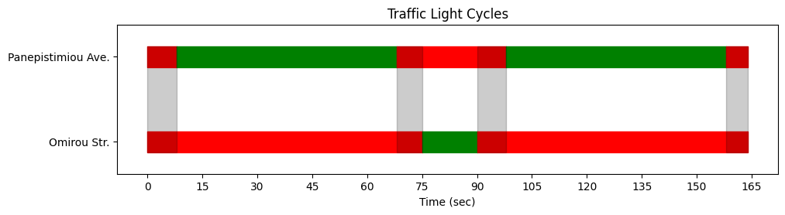

# UAVTrafficPy: Package for analysis & visualization of UAV-based Traffic data in Python

<p align="left">
  
  &nbsp;&nbsp;&nbsp;
  
  &nbsp;&nbsp;&nbsp;
  
</p>

The recent introduction of UAV-based data collection methods in transportation research has unlocked a new realm of possibilities, which was inaccessible in the past due to limitations posed by traditional
sensor-based methods. The quick deployment of coordinated, camera-equipped drones above a large traffic
network, gives researchers the opportunity to acquire large volumes of traffic data with high spatio-temporal
resolution. This has the potential to transform the landscape of data science in transportation research. 

`UAVTrafficPy` is an open-source, Python-based software package dedicated to scientific analysis and visulization of 
UAV-based traffic data in urban networks. It provides users with the ability to extract and visualize vehicle trajectories in various useful forms, calculate position-derivative quantities such as speeds and accelerations, calculate the cumulative distance travelled by vehicles as a function of time, identify network characteristics such as the number and spatial boundaries of lanes, calculate quantities that are useful for the calibration of car-following models, such as relative gaps and speed differences, and finally extract useful information regarding intersections, such as the duration of traffic light phases, and the length and dissipation time of queues.    

`UAVTrafficPy` was tested with Python >=3.12 on Windows.

## Acknowledgments

I would like to thank [KIOS Research & Innovation Center of Excellence](https://www.kios.ucy.ac.cy/) for funding my work through the [URANUS](https://uranus.ucy.ac.cy/) project, which received funding from the European Research Council (ERC) under the ERC Consolidator Grant scheme (Grant agreement No. 101088124). 

“URANUS” (Real-Time Urban Mobility Management via Intelligent UAV-based Sensing) focuses on real-time, dynamic, and intelligent sensing of vehicular and pedestrian traffic via Unmanned Aerial Vehicles (UAVs), and the use of the collected information for urban mobility management.

## Table of contents

- [Installation & Usage](#installation--usage)
- [Community contributions to UAVTrafficPy](#community-contributions-to-uavtrafficpy)
  - [Do you have a question?](#do-you-have-a-question?)
  - [Do you want to contribute?](#do-you-want-to-contribute)
  - [Do you want to report a bug?](#do-you-want-to-report-a-bug)
- [How to use UAVTrafficPy for signalized intersections](#how-to-use-UAVTrafficPy-for-signalized-intersections)
  - [Acquiring the data in the correct format](#acquiring-the-data-in-the-correct-format)
  - [Setting up the analysis](#setting-up-the-analysis)
  - [Analysis & Visualization](#analysis--visualization)


## Installation & Usage

To install `UAVTrafficPy`, you can clone the repository and install all the required packages from the `requirements.txt` by running `pip install -r requirements.txt` in the terminal from the `UAVTrafficPy` folder. 

>[!IMPORTANT]
> In order to use `UAVTrafficPy`, you will need some UAV-based traffic data. I personally recommend the open-source [pNEUMA dataset](https://open-traffic.epfl.ch/index.php/downloads/) to get started. A fraction of this dataset exists at [this location](https://github.com/KPourgourides/UAVTrafficPy/blob/main/tests/dataset_example.csv) in the repository for testing purposes. Also, before using `UAVTrafficPy` properly, you will need to transform any dataset you are willing to use into a particular format, which is explained in detail in this section: [How to use UAVTrafficPy for intersections"](#how-to-use-UAVTrafficPy-for-intersections). A python script that performs the correct transformations for the pNEUMA dataset exists at [this location](https://github.com/KPourgourides/UAVTrafficPy/blob/main/tests/dataload_example.py) in the repository. If you run `usage example/intersection_pipeline_example.py` these tranformations are applied automatically within the script.

## Community contributions to UAVTrafficPy

All contributions, feedback, and questions are welcome! Please read below for specifics.

### Do you have a question?

If you have a question on how to install or run `UAVTrafficPy`, or anything else related to the techniques used in the methods, open an [issue](https://github.com/KPourgourides/UAVTrafficPy/issues/new). Please provide appropriate context that builds up to your question
and then clearly state your question. Before submitting a question, please carefully read all the documentations and previous issues, as they might have the answer to your question.

### Do you want to contribute?

Contribution to `UAVTrafficPy` can be done through pull requests, and are very welcome and enouraged. Please make sure that your contributions are in compliance with the rest of the project and its working principles, which arw discussed in detail in the section ["How to use UAVTrafficPy for Intersections"](#how-to-use-uavtrafficpy-for-intersections). All contributed code must follow the coding standards defined in the project's [pylintrc configuration](https://github.com/KPourgourides/UAVTrafficPy/blob/main/.pylintrc) to ensure code uniformity. Please make sure that your code passes pylint checks before submitting a pull request. Please open pull requests to the `dev` branch.

### Do you want to report a bug?

If you want to report a bug please open an [issue](https://github.com/KPourgourides/UAVTrafficPy/issues/new) and clearly state the bug, the related files in the repository, and what went wrong with respect to the behaviour you expected.

## How to use UAVTrafficPy for signalized intersections

This section provides a detailed walkthrough on how to use `UAVTrafficPy` properly in order to extract valuable information and make insightful visualizations regarding urban signalized intersections in the light of UAV-based traffic data. Here, we follow closely the code provided in [this usage example](https://github.com/KPourgourides/UAVTrafficPy/blob/main/usage%20example/intersection_pipeline_example.ipynb). Of course, the tools showcased below and the rest of the tools not shown here can also be used when conducting analyses for non-intersection parts of a traffic network, such as simple road links.

>[!WARNING]
> In this walkthrough, we use data from the open-source [pNEUMA dataset](https://open-traffic.epfl.ch/index.php/downloads/), and specifically the dataset `20181024_d2_0900_0930.csv`. We proceed to use the tool for a specific intersection, data of which are contained in this dataset. This intersection has a certain topology, entry and exit points, possible routes, lanes, traffic light phases, and other characteristics. When a user wishes to deploy the tool for a different intersection, they should make the appropriate modifications in the inputs of the methods described below. **I recommended using a Python-based Jupyter Notebook when working with intersections, as the tool acts as a pipeline to complete a number of subsequent tasks that each have their own separate results and outputs.**

### Acquiring the data in the correct format

In order to use the tool properly in later stages, the first and most important task is to acquire the UAV-based
data we want to analyze in the **correct format**. Different open-source datasets use different formats, which are oftentimes
unclear for the sake of compactness. Because of this, the tool was designed to take the input data **only in one format**. Thus, we might have to do some data pre-processing before being able to successfully deploy the tool for our research.

UAV-based traffic datasets usually include information on the different individual vehicles in the recording,
such as the **IDs** (unique numbers) and the **types** (e.g., car, motorcycle, bus). Additionally, they also include the **positions** labeled by **time**. Some datasets may also provide information on speeds and accelerations, also labeled by time, but because they can be extracted by the positions, they are not a mandatory input for the tool.

>[!NOTE]
>The positions are 2 dimensional coordinates (y,x) and are always given with respect to a reference system; for example, the World Geodetic System 84, which uses latitude and lognitude.

`UAVTrafficPy` takes the above data as input in order to perform analysis and visualization tasks. The correct way to pass the data to `UAVTrafficPy` is to create a **dictionary**, where each key corresponds to a different piece of information (e.g., IDs, type, positions, time). For example,

```
data = {'id':id, 'vtype':vtype, 'x':X, 'y':Y, 'time':T}
```

Each key of this dictionary corresponds to a list. For **id** and **vtype** the lists contain integer and string elements which respectively correspond to a unique number and a type for each vehicle. For example,

```
data.get('id') = [0,1,...,N]

data.get('vtype') = ['Car','Motorcycle',...,'Bus']
```

Where the total number of vehicles is N+1. The rest of the dictionary keys correspond to lists with nested lists, one per vehicle in the dataset. The elements of each nested list correspond to different time stamps, and their length varies based on how much time the corresponding vehicle spent in the recording. For example,

`data.get('time')` = $[T^0,T^1,...,T^N]$

`data.get('x')` = $[X^0,X^1,...,X^N]$

`data.get('y')` = $[Y^0,Y^1,...,Y^N]$

To understand the content of the nested lists, we see below how they would look like for a vehicle with id $i$

$T^i$  = $[t_0,...,t_k]^i$

$X^i$  = $[x(t_0),...,x(t_k)]^i$

$Y^i$  = $[y(t_0),...,y(t_k)]^i$

Where the total number of time steps *(or measurements)* of the vehicle in the recording are k+1. The frequency of the time steps *(how many of them in 1 second)* is equal to the refresh rate of the drone's camera. 

When we convert a UAV-based traffic dataset in the format described above, we are ready to use
`UAVTrafficPy` to conduct our analysis and visualization tasks for an intersection of our choice. An example on
how to do the above data transformations on the pNEUMA dataset exists at [this location](https://github.com/KPourgourides/UAVTrafficPy/blob/main/tests/dataload_example.py) in the repository.

### Setting up the analysis

#### Defining the intersection under study

Initially, we must identify the intersection we want to work with through satellite imagery software, for example GoogleMaps, and spot important information such as the different possible routes. In this walkthrough, we study the signalized intersection between Panepistimiou Ave and Omirou Str in Athens, Greece, for a 15 minute recording in the morning hours of the 24th of October, 2018.

<p align="center">
  
</p>

For Panepistimiou Ave., there are 4 lanes in total *(3 + 1 bus lane)*, and drivers can either
drive forward or turn leftwards into Omirou Str. For Omirou Str, there is only 1 lane, and drivers can either drive forward or turn rightwards into Panepistimiou Ave.

#### Acquiring important spatio-temporal information on the intersection

Before proceeding further, we must acquire some important spatio-temporal information on the intersection we want to work with, which will serve as a stepping stone for later. The first piece of information we need to gather is the `bbox ` *(bounding box)*, which is essentially a list of four sets of spatial coordinates that
define *(are the vertices of)* a box that encloses the intersection. It is important that the box edges perpendiculary intersect the roads the intersection. 
The tool will use the `bbox` later to only keep data for vehicles that have traversed it at some point in the recording, and discard the rest that are irrelevant to the intersection, thus reducing the original dataset, and making future analysis & visualization steps quicker and more efficient. The `bbox` has the following form

```
bbox = [(ll_y,ll_x),(lr_y,lr_x),(ur_y,ur_x),(ul_y,ul_x)]
```

Where ll, lr, ur, and ul respectively correspond to lower left, lower right, upper right, and upper left, and we can pick up these coordinates from GoogleMaps. Additionally, we must provide a tuple with the center coordinates of the intersection, which will be used for some specific tasks later.

`intersection_center = (y_center,x_center)`

The last piece of information we need to gather is the `time_axis` of the recording. It is a list that contains all the time steps of the recording, independent of when individual vehicles entered or exited the intersection. Mathematically, the individual time axes of different vehicles, $[T^0,...,T^N]$, are subsets of the global `time_axis`. It is defined as

`time_axis`  = $[t^{\text{start}},...,t^{\text{end}}]$

The length of the `time_axis` is equal to the refresh rate of the drone's camera times the duration of the recording in seconds. For example, if the recording was conducted with a 60 FPS camera for 10 minutes, `time_axis` will include 60$[sec^{-1}] \times$ 10 $\times$ 60 $sec$  = 36000 time steps. Once we have gathered all the above information, we store it in a dictionary in the following fashion

```
spatio_temporal_info = {'bbox':bbox, 'intersection center':intersection_center', 'time axis':time_axis}                  
```

### Analysis & Visualization

#### Loading the tool

To load the tool in the Python environment, we run the following commands

```
from UAVTrafficPy.tool import uavtrafficpy
tool = uavtrafficpy.Master()
```

To set up the analysis and visualization classes, we simply run the following

```
analysis = tool.analysis(raw_data,spatio_temporal_info)
visualization = tool.visualization(raw_data,spatio_temporal_info)
```

Where `raw_data` is the data directory in the correct form, as described above.

#### Filtering the data


In order to load the data only in the area of interest as dictated by the `bbox`, in this case the intersection, we run the following command

`data = tool.dataloader(raw_data,spatio_temporal_info).get_bounded_data()`

Optionally, we can apply some filters to `raw_data` to flush out parked vehicles, as they do not contribute in the traffic and might slow down the analysis. A vehicle is considered to be parked if it spent more than 95% of its presence in the recording being immovable. 
This is achieved with the following command

`data = tool.dataloader(raw_data,spatio_temporal_info).get_filtered_data()`

which both bounds and filters the data. We can also optionally pass the argument `cursed_ids` to `get_filtered_data()`, where we can list any vehicle IDs that we
desire to have explicitly removed from the dataset, even if they do not satisfy the parking condition. 

>[!NOTE]
> In both cases, instead of just bounding and/or filtering the data, the two functions also add a new key called `speed` to the `data` dictionary, which corresponds to a list of nested lists, one per vehicle, with their time-dependent speeds in kilometers per hour.

#### Categorizing the trajectories based on their routes

The first task is to categorize the different vehicle trajectories based on their routes, or more specifically, based on their origin (o; *entry point)* and destination (d; *exit point*) within the intersection. This will be important for later steps when we want to separate the data based on different routes
to conduct separate analyses.

To achieve this, the intersection is split into 4 triangles using the `intersection_center` and the `bbox`. Each triangle is labeled with numbers 1 through 4, starting
from the lower part of the intersection and proceeding clockwise. An od pair is assigned for each vehicle based on their route. For
example, if a vehicle enters the intersection within triangle 1 and exits it within triangle 3 *(driving forward on
Panepistimiou Ave.)*, then the assigned od pair will be `(1,3)`. We can visualize the different od pairs with the following command

`visualization.draw_trajectories_od()`

<p align="center">
  
</p>

We can use the above plot to identify the correct od pairs for our intersection. Those are `(1,3)` *(Driving forward on Panepistimiou Ave.)*,
`(1,2)` *(Initially driving on Panepistimiou Ave. and then turning leftwards into Omirou Str.)*, `(4,3)` *(Initially driving on
Omirou Str. and then turning rightwards into Panepistimiou Ave.)*, and finally `(4,2)` *(Driving forward on Omirou Str.)*. We can visualize the vehicle trajectories with different colors based on their od pair for clarity by running the following command

`visualization.draw_trajectories_cc(valid_od_pairs)`

<p align="center">
  
</p>

Where blue, orange, green and red respectively correspond to od pairs `(1,3)`, `(1,2)`, `(4,2)`, and `(4,3)`. The argument `valid_od_pairs` is a list that contains the correct od pairs, `valid_od_pairs = [(1,3),(1,2),(4,3),(4,2)]`. This trajectory categorization is also helpful for the calculation of the turn ratios for each street. For our case, they are depicted below

<p align="center">
  
</p>

The next step is to separate the `data` dictionary into smaller sub-dictionaries based on the different origins / entry points. This step will be helpful later on when we will conduct origin-specific analyses. In our case, we must make two data sub-dictionaries, `data_a` and `data_b`, for od pairs `(1,3),(1,2)` and `(4,3),(4,2)` respectively. To do this, we run the following commands

```
data_a = analysis.get_od_data(desirable_pairs=[(1,3),(1,2)])
data_b = analysis.get_od_data(desirable_pairs=[(4,3),(4,2)])
```

In the following steps of the analysis and visualization process, the methods we will discuss are applied separately on the
two data sub-dictionaries, and their variable names will end in either `_a` or `_b` depending on which sub-dictionary we use. To do this, we set up separate analysis and visualization classes with the following
commands

```
analysis_a = tool.analysis(data_a,spatio_temporal_info)
visualization_a = tool.visualization(data_a,spatio_temporal_info)

analysis_b = tool.analysis(data_b,spatio_temporal_info)
visualization_b = tool.visualization(data_b,spatio_temporal_info)
```

#### Extracting lane-wise information

The next task is to extract lane-wise information for the components of the intersection. By lane-wise information, we mean the number of lanes, their spatial boundaries, and the distribution of vehicles in them for each of their time steps.

The number of lanes in a road and their corresponding spatial boundaries can be extracted by forming the
lateral distribution of vehicles along that road. It is expected that vehicles which move along the same lane
will have approximately the same lateral distance from the edge of the road, and thus, the time-average of this
quantity is calculated for every vehicle in the road. The distribution of this quantity is expected to form distinct
peaks centered about the lateral center of each corresponding lane. Each peak represents one existent lane, and
thus the total number of peaks is equal to the number of lanes in the road. For example, to visualize this distribution for Panepistimiou Ave, we simply run the following command

`lane_info_a = analysis_a.get_lane_info(flow_direction='up')`

Where `flow_direction` is one of `['up','down','left','right]`; flow towards the north corresponds to `'up'`, towards the south corresponds to `down`, etc.. Initially, we will see this histogram

<p align="center">
  
</p>

Now, We will be asked to input the number of lanes we see *(i.e. the number of peaks in the distribution - in this case 4)*, and subsequently to provide the lower and upper limits of the distribution. After we input this information, a clustering algorithm will calculate the spatial boundaries of each lane, and we will see the resulting figure

<p align="center">
  
</p>

Here, `lane_info_a` is a dictionary that includes all the information we need. Its keys are `number` *(integer)* and `boundaries` *(list)*, which respectively correspond to the number of lanes and the float values that are the lane boundaries along the width of the road. Also, it has an additional key called `distribution`, which is a list of nested lists, one per vehicle, and includes the lane in which the vehicle belonged to, per time step. If at some point a vehicle had left the road, the corresponding values from that point onwards will be `None`. 

#### Extracting traffic light phases & cycles

Traffic light phases can be extracted through the placement of virtual detectors at the real positions of traffic
light poles, and the subsequent measurement of flow counts at those points. Since the data are discrete in time,
flow measurements take place in distinct time steps of the `time_axis`. The registered counts at a certain time step correspond
to the number of vehicles that crossed the virtual traffic light pole between the previous and the current time step.
We expected that, for each street, counts that belong to the same phase are registered within a certain time
window, and that there are no registered counts after the window is over for multiple time steps, until the next
cycle repetition. To execute the above task, we run the following commands

```
flow_info_a = analysis_a.get_flow_info(detector_position_a)
flow_info_b = analysis_b.get_flow_info(detector_position_b)
```

Where the `detector_position` argument is a tuple with the coordinates (y,x) of the virtual detector. The
result of the `get_flow_info()` methods is a list of dictionaries, where each nested dictionary has the keys
`time stamp` *(float)*, `flow` *(integer)* and `id` *(list)*, which respectively correspond to the moment of measurement with respect to
the `time_axis`, the number of registered counts between the current and previous time stamp, and
the IDs of the vehicles responsible for the registered count hits. The `id` list is empty if 0 counts were
registered in the corresponding time interval. For example,

```
flow_info_a[time_axis.index(24)] = {'time stamp': 24.0, 'flow': 4, 'id': [71,128,142,145]}
```

Here, 4 vehicles in Panepistimiou Ave drove past the traffic light between the 23rd and 24th second of the recording. This information is utilized to alter the flow detectors outputs into binary *(1 if there were registered count hits, 0 if there were not)*, and group them together. The different groups of registered counts represent the different traffic light phases, and the duration of each
phase is equal to that of the corresponding time window. In order to do that, we run the following commands

```
flow_a,norm_flow_a = analysis_a.get_normalized_flow(threshold=15)
flow_b,norm_flow_b = analysis_b.get_normalized_flow(threshold=15)
```

The `threshold` argument here refers to the maximum accepted distance *(in time)* between two consecutive registered hits in order to consider them in
the same group. The output of both `flow_a`,`flow_b` is a list with the unnormalized hits per step of the `time_axis`, and the output of both `norm_flow_a`,`norm_flow_b`
is also a list, but this time with the normalized and grouped hits per step of the `time_axis`. To visualize the above, we run the commands

```
visualization.draw_traffic_light_phases(norm_flow_a,norm_flow_b,flow_a,flow_b)
```


The black and red counts respectively correspond to Panepistimiou Ave and Omirou Str.

To translate the above figure into formal traffic light phase data, we run the following commands

```
tlp_a = analysis_a.get_traffic_light_phases()
tlp_b = analysis_b.get_traffic_light_phases()
```

The output of both `tlp_a`, `tlp_b` is a list of dictionaries, where each dictionary has the keys 
`Green`,`Duration ON`,`Red`,`Duration OFF`,`Phase Duration`, which respectively correspond to the moment the re-
spective traffic light turned green, the duration of green, the moment it turned red, the duration of red, and the
entire phase duration *(green until next green)*, all in seconds. For example,

```
tlp_a[0] = {'Green':9.0, 'Duration ON':61.0, 'Red':70.0, 'Duration OFF':32.0, 'Phase Duration':93.0}
```

If the recording had stopped before the completion of a phase, the appropriate keys will have the value
`None`. For example, if the recording stopped while a traffic light was red, the key `Duration OFF` cannot be
calculated, and the same holds for key `Phase Duration`. Below we have a visualization for the average duration of the green light, red light, and the entire phase
for Panepistimiou Ave and Omirou Str.

<p align="center">
  
  
</p>

For Panepistimiou Ave, the average duration of the green light, red light and entire phase are 30 $\pm$ 4 secons, 60 $\pm$ 2 seconds and 90 $\pm$ 4 seconds. The corresponding values for Omirou Str are 16 $\pm$ 4 seconds, 74 $\pm$ 3 seconds and 90 $\pm$ 2 seconds.

Next, we combine `tlp_a`, `tlp_b`  in order to get the information on the full cycles, i.e. the
subsequent completion of the 2 individual phases. To do so, we run the following command

`cycles = analysis.get_traffic_light_cycles(tlp_a,tlp_b)`

The output of `cycles` is a list of dictionaries, where each dictionary has the keys `Start`,`Break`,
`Continue`,`Stop`,`End`, which respectively correspond to the moment the cycle started *(i.e. the first phase started)*, the
moment the cycle stops temporarily *(i.e. the first phase goes into red)*, the moment the cycle restarts *(i.e. the
second phase started)*, the moment the cycle stops *(i.e. the second phase goes into red)*, and finally, the moment
the cycle restarts *(i.e. the first phase has re-started)*, all in seconds. For example,

```
cycles[0] = {'Start': 9.0, 'Break': 70.0, 'Continue': 76.0, 'Stop': 96.0, 'End': 102.0}
```

Below we have the visualization of the first cycle in the dataset

<p align="center">
  
</p>

The shaded areas correspond to time windows where both traffic lights where red, possibly a time when pedestrian crossings were active.

#### Extracting car-following information

Car-following parameters are used in traffic flow theory to describe how a driver or automated vehicle react to a
vehicle ahead in the same lane. Some of the parameters include the acceleration, deceleration, speed difference,
and gaps (front to rear bumper) between vehicles. Such information is crucial for microscopic traffic simulation
models.

Information on speed and acceleration (or deceleration) for each vehicle can be simply extracted through
discrete time differentiation of the position coordinates. The accuracy of such calculations depends on the
temporal resolution of the traffic data, which is usually high regarding UAV-based data.

Information which depends on the relative movement between a vehicle and its leader, such as gaps and
speed differences, are extracted as follows. Vehicles IDs in each lane are sorted from last to first vehicle according
to the direction of movement in the lane; e.g., if the vehicles in a lane are moving towards the north, their IDs
are sorted with respect to increasing latitude. Then, once the vehicles are sorted, the calculation of the gaps
or speed differences is trivial due to full knowledge of position coordinates and speeds. The above tasks can be
executed for any time step in the recording. To do the above, we run the following commands

```
sorted_id_a = analysis_a.get_sorted_id()
gaps_a = analysis_a.get_gaps()

sorted_id_b = analysis_b.get_sorted_id()
gaps_b = analysis_b.get_gaps()
```

We are not going to calibrate any car-following models, but to us this information is important as it will later help us extract queue-wise information. The output of both methods is a list of dictionaries, where each dictionary
has the keys `time stamp`, and `lane 0` through `lane L`, where L+1 the total number of lanes. The `time
stamp` corresponds to the current step of the `time_axis`, and each lane-specific key is a list with the sorted IDs or gaps, in meters. For example,

```
sorted_id_a[time_axis.index(tlp_a[7].get('Green'))] = {'time stamp':551.0, 'lane 0':None, 'lane 1':[1778], 'lane 2':[1922, 2021], 'lane 3':[2045, 1659], 'lane 4':[2062]}
gaps_a[time_axis.index(tlp_a[7].get('Green'))] = {'time stamp':551.0, 'lane 0':None, 'lane 1':[-1.0], 'lane 2':[9.4, -1.0], 'lane 3':[14.7, -1.0], 'lane 4':[-1.0]}
```

The value `None` is for when there are no vehicles in the lane, and the value `-1.0` corresponds to lane leaders
that have no vehicles in front of them.

### Extracting queue-wise information

We proceed with the calculation of the queue-wise information when the queue has its maximum potential, i.e. the moments when the traffic light turns green for the different phases. For each street, and for each of its lanes, a vehicle is considered to be part of the queue at the time of the corresponding green light if it satisfies the following conditions:

1. It is physically behind the virtual detector that represents the traffic light pole
2. Its instantaneous speed is lower than a given threshold $u_{threshold}$
3. Its gap from the next vehicle is lower than a given threshold  $g_{threshold}$ *(except the queue leader)*

The vehicles that satisfy the above conditions form the queue at the corresponding traffic light phase. A depiction of these conditions is given below

<p align="center">
  
</p>

The rightmost motorcycle is not considered to be in the queue because it violates condition 1, as it has already crossed the virtual traffic light pole, even though conditions 2 and 3 might be satisfied. The leftmost car is also not considered to be in the queue, because despite the fact that it satisfies condition 1, it has yet to slow down and reach the tail of the queue, and thus violates conditions 2 and 3. The truck and the car in the middle are considered to be part of the queue, as they satisfy all 3 conditions.

To formally extract the queue-wise information, we run the following commands

```
queue_info_a = analysis_a.get_queue_info(speed_threshold,gap_threshold)
queue_info_b = analysis_b.get_queue_info(speed_threshold,gap_threshold)
```

The output of the above methods is a list of lists, where each nested list corresponds to a traffic light phase,
and has L+1 dictionaries inside, corresponding to the total number of lanes. Each nested dictionary has the 
keys `Lane`,`Queued Vehicles`,`Queue Length`,`Queued IDs`,`Dissipation Duration`, which respectively correspond
to the lane in question, the number of queued vehicles at the time of green light, the queue length in meters, the
ids of the queued vehicles, and the queue dissipation duration in seconds. 

The `Queue Length` is calculated as the sum of the vehicles lengths and the gap
we derived earlier, whereas the `Dissipation Duration` is the time it
takes for all the queued vehicles to move past the green light pole. If only a part of the queue dissipates before the
light turns red again, the queue dissipation duration is then equal to the duration of the green light. For example,

```
queue_info_b[6] = [{'Lane':0, 'Queued Vehicles':6, 'Queue Length':38.0, 'Queued IDs':[2192, 2166, 2139, 2067, 2029, 1784], 'Dissipation Duration':11.0}]
```

This concludes the usage walkthrough.
