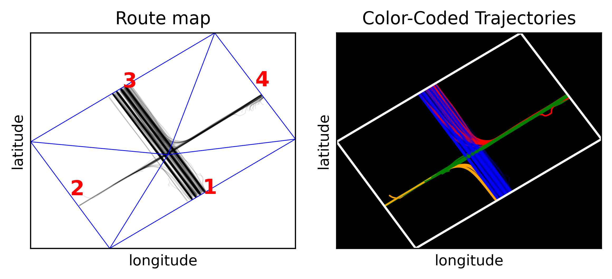
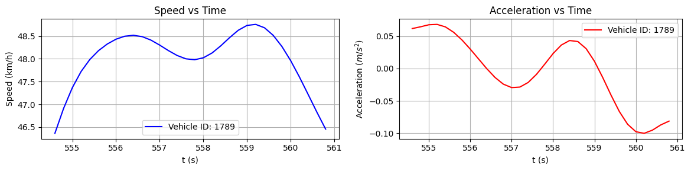

# Summary

(!!!) This paper introduces UAVTrafficPy, an open-source software package in Python for scientific analysis and visualization of UAV-based traffic data. This tool provides users with the ability to extract important information and make insightful visualizations regarding any UAV-based traffic dataset, with a significant focus on signalized intersections in urban networks. UAVTrafficPy was developed within the ERC project "URANUS" to help researchers or students working in UAV-based transportation engineering with their research tasks by providing ready-to-use tools for analysis and visualization.

# Statement of need

The recent introduction of UAV-based data collection methods in transportation research has unlocked a new realm of possibilities, which was inaccessible in the past due to limitations posed by traditional sensor-based methods. These traditional methods refer to data collection through static loop detectors beneath the road network or static cameras, as well as from GPS or bluetooth signals from mobile phones of drivers. The limitations with some, or all of these methods, amongst others, include the inability to store high quality spatio-temporal information for individual vehicles (loop detectors), the inability to cover large parts of a traffic network (static cameras), and sparsity (GPS and bluetooth signals). 

UAV-based data collection solves all of these problems. The quick deployment of coordinated, camera-equipped drones above a large traffic network, gives researchers the ability to acquire large volumes of traffic data for all individual vehicles in the network, with high spatio-temporal resolution. This has the potential to transform the landscape of data science in transportation research, as long as new and appropriate tools are developed. 

[UAVTrafficPy](https://github.com/KPourgourides/UAVTrafficPy) is an initial attempt to bridge this gap, as it provides users with tools to extract and visualize vehicle trajectories in various useful forms, calculate position-derivative quantities such as speeds and accelerations, calculate the cumulative distance travelled by vehicles as a function of time, identify network characteristics such as the number and spatial boundaries of lanes, calculate quantities that are useful for the calibration of car-following models, such as relative dynamic gaps and speed differences, and finally extract useful information regarding intersections, such as the duration of traffic light phases, and the length and dissipation time of queues.

# Software Functionality

UAVTrafficPy was developed in Python3, and acts as a standalone package for analysis and visualization of UAV-based traffic data. It is not an extension of an already existing software. Different UAV-based traffic datasets use different compact formats, which are oftentimes not intuitive, and thus UAVTrafficPy was designed to take the input data in one universal form, based on dictionaries. It only needs minimal information to work, such as vehicle IDs, vehicle types (e.g., car, motorcycle etc.), and 2d position coordinates (based on the WGS84 system, i.e. longitiudinal and latitudinal coordinates) labeled by time for every vehicle. Once a user provides this information with the correct format, UAVTrafficPy can execute a large number of tasks, which are mentioned in the [statement of need](#statement-of-need) section. Some tasks such as the illustration of speed and acceleration for a vehicle as a function of time, and trajectory extraction based on vehicle routes in a signalized intersection, are depicted respectively in \autoref{fig:1} and \autoref{fig:2} 

These tasks were executed by using the file `20181024_d2_0900_0930.csv` from the open-source pNEUMA dataset.

# Acknowledgements

I would like to thank KIOS Research & Innovation Center of Excellence for funding my work through the URANUS project, which received funding from the European Research Council (ERC) under the ERC Consolidator Grant scheme (Grant agreement No. 101088124).

# References

