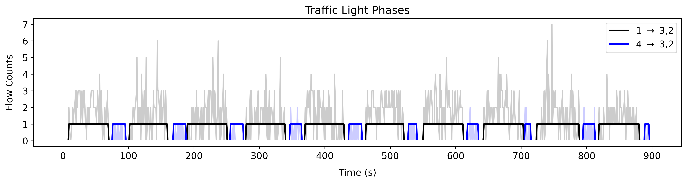
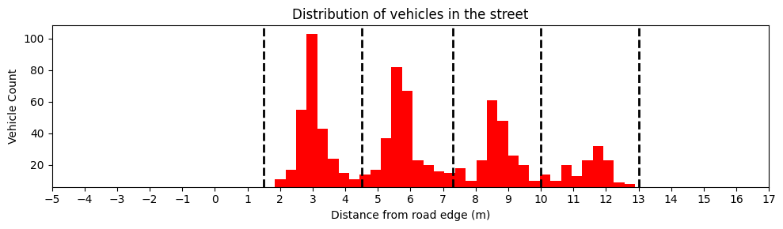

# Summary

This paper introduces UAVTrafficPy, an open-source Python package for scientific analysis and visualization of UAV-based traffic data, with a focus on urban environments, such as arterial roads and signalized intersections. The package provides tools to extract, reconstruct and visualize traffic information at multiple levels: individual vehicles, interactions between successive vehicles, and intersection dynamics.

# Statement of need

The introduction of UAV-based data collection methods in transportation research [@Barmpounakis2020] [@Krajewski2018] has unlocked new possibilities which were inaccessible in the past due to the limitations of traditional sensor-based methods, such as loop detectors, static cameras and probe vehicles equiped with tracking technologies. These conventional methods suffer from different drawbacks, such as sparse data inflow, limited coverage of the traffic network, high installation and maintenance costs, and the inability to capture and store high quality spatio-temporal information for individual vehicles. Usually, they have to be combined together to compensate for their inadequencies and deliver reliable results [@Zhan2017].

On the other hand, the rapid deployment of coordinated and camera-equipped UAVs above traffic networks enables researchers to overcome these limitations, as they can acquire large volumes of data for all individual vehicles in a potentially large area, with high spatio-temporal resolution [@Gupta2021]. This can transform the landscape of traffic analysis in transportation, provided that appropriate tools are developed. [UAVTrafficPy](https://github.com/KPourgourides/UAVTrafficPy) aims to bridge the gap between UAV-based data collection and meaningful, hollistic traffic analysis on multiple levels.

# State of the Field

There are several published works that utilize UAV-based traffic data to accomplish a specific goal or address a particular issue, such as studying vehicle interactions [@Li2025], inferring successive vehicle spacings and their relative speeds [@Jiao2023], calibrating car-following models [@Zhang2022], treating data noise and anomalies [@Mahajan2023], investigating lane-related phenomena [@Clapes2023], and studying the resolution of queues at signalized intersections [@Hu2022]. Additionally, there are open-source software packages that address video analysis for UAV-based traffic monitoring [@Benjdira2022] and simulation of UAV-based data collection in traffic networks [@Tsioutis2025]. 

However, to the best of the authors' knowledge, there is currently no similar work to UAVTrafficPy, which is a standalone, open-source Python package that provides tools for scientific analysis and visualization of post-video UAV-based traffic data on multiple levels in a single platform.

# Software Functionality

UAVTrafficPy provides users with tools for extracting, reconstructing and visualizing UAV-based traffic data on the level of individual vehicles, interactions between successive vehicles, and intersection dynamics.

**Level 1: Individual Vehicles.** Users can reconstruct and visualize trajectories, calculate time-dependent speed and acceleration profiles,
compute cumulative distance travelled. and subsequently visualize space-time diagrams, and detect lane changes.

**Level 2: Interactions between successive vehicles.** Users can compute relative dynamic gaps and relative speed differences between successive vehicles, two quantities that are commonly used as variables in the calibration of car-following models.

**Level 3: Intersection Dynamics**. Users can calculate turn ratios, extract information on traffic light phases and cycles, and compute queue-wise information such as the number of queued vehicles, the queue length, and finally the queue dissipation time.

UAVTrafficPy was developed and tested in Python 3.12, and acts as a standalone package for analysis and visualization of UAV-based traffic data. It requires only minimal information to operate, such as vehicle IDs, vehicle types, and 2D positional coordinates in the WGS84 system, labeled by time for every vehicle. Once a user provides this information in the appropriate format, which is thoroughly explained in the [walkthrough](https://github.com/KPourgourides/UAVTrafficPy?tab=readme-ov-file#acquiring-the-data-in-the-correct-format) on the repository's frontpage, UAVTrafficPy can perform a wide range of tasks. Examples include the reconstruction of vehicle trajectories based on routes, as well as the visualization of traffic light phases within a signalized intersection \autoref{fig:1}, and the extraction of the lateral distriubtion of vehicles in a road \autoref{fig:2} for the recognition of lane characteristics. These tasks were executed by using the file `20181024_d2_0900_0930.csv` from the open-source pNEUMA dataset [@Barmpounakis2020].

# Acknowledgements

This work is supported by the European Union (i. ERC, URANUS, No. 101088124 and, ii. Horizon 2020 Teaming, [KIOS CoE](https://www.kios.ucy.ac.cy/), No. 739551), and the Government of the Republic of Cyprus through the Deputy Ministry of Research, Innovation, and Digital Strategy. Views and opinions expressed are however those of the author(s) only and do not necessarily reflect those of the European Union or the European Research Council Executive Agency. Neither the European Union nor the granting authority can be held responsible for them.

# References

